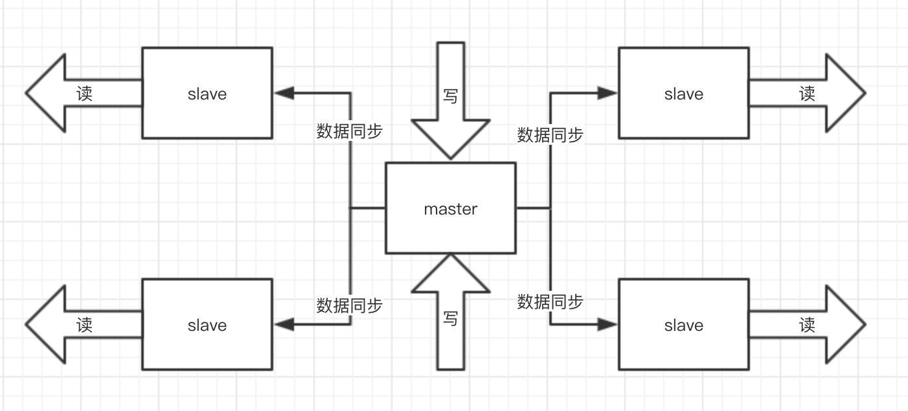
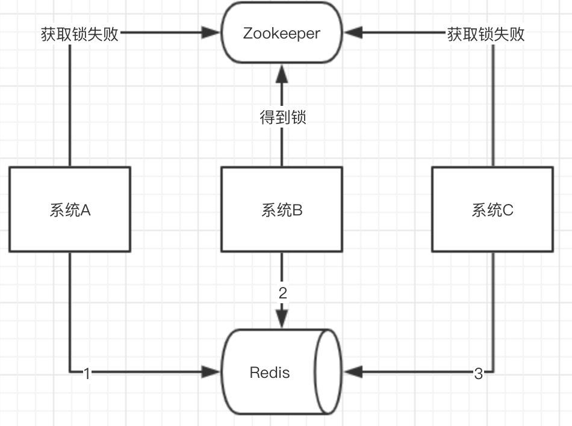

<p class="description">Redis基础问题</p>
<!-- more -->
  

# Redis  


## Redis基础[^1]  


## 缓存击穿、雪崩、穿透[^2]  


## 集群高可用、哨兵、持久化、LRU[^3]  


## 分布式锁、并发竞争、双写一致性[^4]  


[^1]: # Redis基础  

### 为什么项目中用Redis？

传统的关系型数据库，如Mysql已经**不能适用所有的场景**

比如`秒杀的库存扣减`，`APP首页的访问流量高峰`等等，都很容易把数据库打崩，所以引入了缓存中间件

目前市面上比较常用的缓存中间件有`Redis `和`Memcached`

### Redis有哪些数据结构?

`字符串String`、`字典Hash`、`列表List`、`集合Set`、`有序集合SortedSet`

进阶: 

`HyperLogLog`、`Geo`、`Pub/Sub`

`Redis Module`，像`BloomFilter`，`RedisSearch`，`Redis-ML`

### 如果有大量的key需要设置同一时间过期，一般需要注意什么？

如果大量的key过期时间设置的过于集中，到过期的那个时间点，redis可能会出现短暂的卡顿现象  

严重的话会出现缓存雪崩，我们一般需要在时间上加一个随机值，使得过期时间分散一些  

### 使用过Redis分布式锁么，它是什么回事？

先使用`setnx`来争抢锁，抢到之后，再用`expire`给锁加一个过期时间防止锁忘记了释放。

#### 如果在setnx之后执行expire之前进程意外crash或者要重启维护了，那会怎么样？

set指令有非常复杂的参数，应该是可以同时把setnx和expire合成一条指令来使用

### 假如Redis里面有1亿个key，其中有10w个key是以某个固定的已知的前缀开头的，如何将它们全部找出来？

使用`keys`指令可以扫出指定模式的key列表

#### 如果这个redis正在给线上的业务提供服务，那使用keys指令会有什么问题？

redis的单线程的。keys指令会导致**线程阻塞**一段时间，线上服务会停顿，直到指令执行完毕，服务才能恢复

可以使用**scan**指令，**scan**指令可以无阻塞的提取出指定模式的key列表，但是会有一定的重复概率，在客户端做一次去重就可以了，但是整体所花费的时间会比直接用keys指令长

**增量式迭代命令也有其缺点：**

比如， 使用 SMEMBERS 命令可以返回集合键当前包含的所有元素， 

但是对于SCAN 这类增量式迭代命令来说， 因为在对键进行增量式迭代的过程中， **键可能会被修改**， 所以增量式迭代命令只能对被返回的元素提供有限的保证 。​

### 使用过Redis做异步队列么，是怎么用的？

一般使用list结构作为队列，**rpush**生产消息，**lpop**消费消息。当lpop没有消息的时候，要适当sleep一会再重试

#### 可不可以不用sleep呢？

list还有个指令叫 **blpop** ，在没有消息的时候，它会阻塞住直到消息到来。

#### 能不能生产一次消费多次呢？

使用`pub/sub`主题订阅者模式，可以实现 1:N 的消息队列

#### pub/sub有什么缺点？

在消费者下线的情况下，生产的消息会丢失，建议使用专业的消息队列

#### Redis如何实现延时队列？

使用`sortedset`

使用时间戳作为`score`，消息内容作为`key`调用`zadd`来生产消息

消费者用`zrangebyscore指令`获取N秒之前的数据，轮询进行处理

### Redis是怎么持久化的？服务主从数据怎么交互的？

`RDB`做镜像全量持久化，`AOF`做增量持久化。

因为RDB会耗费较长时间，不够实时，在停机的时候会导致大量丢失数据，所以需要AOF来配合使用

在redis实例重启时，会使用RDB持久化文件重新构建内存，再使用AOF重放近期的操作指令来实现完整恢复重启之前的状态


不过Redis本身的机制是 AOF持久化开启且存在AOF文件时，优先加载AOF文件；

AOF关闭或者AOF文件不存在时，加载RDB文件；加载AOF/RDB文件城后，Redis启动成功；

AOF/RDB文件存在错误时，Redis启动失败并打印错误信息

#### 如果突然机器掉电会怎样？

取决于AOF日志sync属性的配置

如果不要求性能，在每条写指令时都sync一下磁盘，就不会丢失数据

但是在高性能的要求下每次都sync是不现实的，一般都使用定时sync，比如1s1次，这个时候最多就会丢失1s的数据

### RDB的原理是什么？

`fork`和`cow`

fork是指redis通过创建子进程来进行RDB操作

cow指的是copy on write，子进程创建后，父子进程共享数据段，父进程继续提供读写服务，写脏的页面数据会逐渐和子进程分离开来  


📌  **todo** 说出AOF和RDB的优缺点

### Pipeline有什么好处，为什么要用pipeline？

可以将多次IO往返的时间缩减为一次，前提是pipeline执行的指令之间没有因果相关性  

使用redis-benchmark进行压测的时候可以发现影响redis的QPS峰值的一个重要因素是**pipeline批次指令的数目**。

### Redis的同步机制了解么？

Redis可以使用主从同步，从从同步  

第一次同步时，主节点做一次bgsave，并同时将后续修改操作记录到内存buffer，待完成后将RDB文件全量同步到复制节点，复制节点接受完成后将RDB镜像加载到内存

加载完成后，再通知主节点将期间修改的操作记录同步到复制节点进行重放就完成了同步过程

后续的增量数据通过AOF日志同步即可，有点类似数据库的binlog  

### 是否使用过Redis集群，集群的高可用怎么保证，集群的原理是什么？

Redis Sentinal着眼于高可用，在master宕机时会自动将slave提升为master，继续提供服务

Redis Cluster着眼于扩展性，在单个redis内存不足时，使用Cluster进行分片存储
[^2]: # 缓存击穿、雪崩、穿透

### Redis雪崩了解吗？

首页以及热点数据都会去做缓存 ，一般缓存都是**定时任务刷新**，或者是**查不到**之后去**更新**的，定时任务刷新就有一个问题

**举个例子** ：

如果所有首页的Key失效时间都是12小时，中午12点刷新的，我零点有个秒杀活动大量用户涌入

假设当时每秒6000 个请求，本来缓存在可以扛住每秒 5000 个请求，但是缓存当时所有的Key都失效了

此时 1 秒 6000个请求全部落数据库，数据库必然扛不住，它会报一下警，真实情况可能DBA都没反应过来就直接挂了

此时，如果没用什么特别的方案来处理这个故障，DBA很着急，重启数据库，但是数据库立马又被新的流量给打死了。这就是我理解的缓存雪崩  


**同一时间大面积失效，那一瞬间Redis跟没有一样**

**如果打挂的是一个用户服务的库，那其他依赖库所有的接口几乎都会报错，如果没做熔断等策略基本上就是瞬间大量微服务不可用**

#### 这种情况怎么去应对？

处理缓存雪崩简单，在批量往**Redis**存数据的时候，把每个Key的失效时间都加个随机值就好了，这样可以保证数据不会在同一时间大面积失效

```java
  setRedis（Key，value，time + Math.random() * 10000）；
```

如果Redis是**集群部署**，将热点数据均匀分布在不同的**Redis**库中也能避免全部失效的问题

不过在生产环境中操作集群的时候，单个服务都是对应的单个**Redis**分片，是为了方便数据的管理，但是也同样有了可能会失效这样的弊端，失效时间随机是个好策略  

或者设置热点数据永远不过期，有更新操作就更新缓存就好了（比如运维更新了首页商品，那你刷下缓存就完事了，不要设置过期时间），电商首页的数据也可以用这个操作，保险  

### 了解缓存穿透和击穿么，可以说说他们跟雪崩的区别么？

**缓存穿透**是指缓存和数据库中都没有的数据，而用户不断发起请求，我们数据库的 id 都是1开始自增上去的，如发起为id值为 -1 的数据或 id 为特别大不存在的数据。

这时的用户很可能是攻击者，攻击会导致数据库压力过大，严重会击垮数据库

**缓存击穿**跟**缓存雪崩**有点像，但是又有一点不一样。

缓存雪崩是因为大面积的缓存失效，打崩了DB

而缓存击穿不同的是**缓存击穿**是指一个Key非常热点，在不停的扛着大并发，大并发集中对这一个点进行访问

当这个Key在失效的瞬间，持续的大并发就穿破缓存，直接请求数据库，就像在一个完好无损的桶上凿开了一个洞  

#### 分别怎么解决？

**缓存穿透**

1、在接口层增加校验，比如用户鉴权校验，参数做校验，不合法的参数直接代码Return

**在开发程序的时候都要有一颗“不信任”的心，就是不要相信任何调用方**

**比如你提供了API接口出去，你有这几个参数，那我觉得作为被调用方，任何可能的参数情况都应该被考虑到，做校验**

**因为你不相信调用你的人，你不知道他会传什么参数给你**

2、从缓存取不到的数据，在数据库中也没有取到，这时也可以将对应Key的Value对写为null、位置错误、稍后重试这样的值

3、或者看具体的场景，缓存有效时间可以设置短点，如30秒，这样可以防止攻击用户反复用同一个id暴力攻击，

4、对单个IP每秒访问次数超出阈值的IP都拉黑  

5、Redis还有一个高级用法 **布隆过滤器（Bloom Filter）** 这个也能很好的防止缓存穿透的发生，

原理就是利用高效的数据结构和算法快速判断出你这个Key是否在数据库中存在，不存在你return就好了，存在你就去查了DB刷新KV再return


**缓存击穿**

设置热点数据永远不过期。或者加上互斥锁  
[^3]: # 集群高可用、哨兵、持久化、LRU

## 为啥Redis那么快？

先看一下关系型数据库跟Redis本质上的区别


Redis采用的是基于内存的采用的是单进程单线程模型的 KV 数据库，由C语言编写，官方提供的数据是可以达到100000+的 **QPS（每秒内查询次数）** 

* 完全基于内存，绝大部分请求是纯粹的内存操作，非常快速

  数据存在内存中，类似于 **HashMap** ，**HashMap**的优势就是查找和操作的时间复杂度都是O(1)
* 数据结构简单，对数据操作也简单，Redis中的数据结构是专门进行设计的
* 采用**单线程**，**避免了不必要的上下文切换和竞争条件**，也不存在多进程或者多线程导致的切换而消耗 CPU，不用去考虑各种锁的问题，不存在加锁释放锁操作，没有因为可能出现死锁而导致的性能消耗
* 使用多路I/O复用模型，非阻塞IO
* 使用底层模型不同，它们之间底层实现方式以及与客户端之间通信的应用协议不一样

Redis自己构建了VM 机制 ，因为一般的系统调用系统函数的话，会浪费一定的时间去移动和请求

**Redis 的 VM (虚拟内存)机制**就是暂时把不经常访问的数据(冷数据)从内存交换到磁盘中，从而腾出宝贵的内存空间用于其它需要访问的数据(热数据)。

通过 VM 功能可以实现冷热数据分离，使热数据仍在内存中、冷数据保存到磁盘。

这样就可以避免因为内存不足而造成访问速度下降的问题。

**通信协议**：基于TCP的应用层协议 RESP(Redis Serialization Protocol)

## Redis是单线程的，现在服务器都是多核的，那不是很浪费？

是的他是单线程的，但是，我们可以通过在单机开多个Redis实例

## 既然提到了单机会有瓶颈，那怎么解决这个瓶颈？

集群的部署方式也就是Redis cluster，并且是主从同步读写分离，类似Mysql的主从同步

Redis cluster 支撑 N 个 Redis master node，每个master node都可以挂载多个 slave node。

这样整个 Redis 就可以横向扩容了

如果你要支撑更大数据量的缓存，那就横向扩容更多的 master 节点，每个 master 节点就能存放更多的数据了

### 之间是怎么进行数据交互的？以及Redis是怎么进行持久化的？

* RDB：RDB 持久化机制，是对 Redis 中的数据执行周期性的持久化。
* AOF：AOF 机制对每条写入命令作为日志，以 append-only 的模式写入一个日志文件中，因为这个模式是只追加的方式，所以没有任何磁盘寻址的开销，所以很快，有点像Mysql中的binlog

两种方式都可以把**Redis**内存中的数据持久化到磁盘上，然后再将这些数据备份到别的地方去

**RDB**更适合做 **冷备** ，**AOF**更适合做**热备**

tip：两种机制全部开启的时候，Redis在重启的时候会**默认使用AOF去重新构建数据**，因为AOF的数据是比RDB更完整的

* RDB

  **优点：**  
  生成多个数据文件，每个数据文件分别都代表了某一时刻Redis里面的数据，这种方式，有没有觉得很适合做**冷备**

  完整的数据运维设置定时任务，定时同步到远端的服务器，比如阿里的云服务，这样一旦线上挂了，你想恢复多少分钟之前的数据，就去远端拷贝一份之前的数据就可以

  RDB对Redis的性能影响非常小，是因为在同步数据的时候他只是fork了一个子进程去做持久化的，而且他在数据恢复的时候速度比AOF来的快

  **缺点：**  
  RDB都是快照文件，都是默认五分钟甚至更久的时间才会生成一次，这意味着你这次同步到下次同步这中间五分钟的数据都很可能全部丢失掉

  AOF则最多丢一秒的数据，数据完整性上高下立判

  还有就是RDB在生成数据快照的时候，如果文件很大，客户端可能会暂停几毫秒甚至几秒，你公司在做秒杀的时候他刚好在这个时候fork了一个子进程去生成一个大快照，哦豁，出大问题。
* AOF

  **优点：**

  RDB五分钟一次生成快照，但是AOF是一秒一次去通过一个后台的线程fsync操作，宕机最多丢这一秒的数据AOF在对日志文件进行操作的时候是以append-only的方式去写的，他只是追加的方式写数据，自然就少了很多磁盘寻址的开销了，写入性能惊人，文件也不容易破损

  AOF的日志是通过非常可读的方式记录的，这样特性适合做灾难性数据误删除的紧急恢复了，

  比如通过flushall清空了所有的数据，只要这个时候后台重写还没发生，马上拷贝一份AOF日志文件，把最后一条flushall命令删了就可以还原

  **缺点：**

  一样的数据，**AOF**文件比**RDB**要大

  **AOF**开启后，**Redis**支持写的**QPS**会比**RDB**支持写的要低，他每秒都要去异步刷新一次日志**fsync** ，当然即使这样性能还是很高

  记得**ElasticSearch**也是这样的，异步刷新缓存区的数据去持久化

  为啥这么做呢，不直接来一条怼一条呢，这样性能可能低到没办法用的
* 那两者怎么选择？

  **全都使用**

  单独用**RDB**会丢失很多数据，单独用 **AOF** ，数据恢复没**RDB**来的快

  真出事的时候第一时间用**RDB**恢复，然后**AOF**做数据补全

### Redis还有其他保证集群高可用的方式么？

* 哨兵集群**sentinel**

  哨兵必须用三个实例去保证自己的健壮性的，哨兵+主从并 **不能保证数据不丢失** ，但是可以保证集群的 **高可用** 

  每个实例对应一个哨兵
* 如果集群是两个实例，是否健壮？

  假设节点1宕机，两个哨兵只要有一个认为你宕机了就切换了，并且会选举出一个哨兵去执行故障，这个时候需要大多数哨兵都是运行的

  假设节点1对应的实例全部挂掉，则对应的哨兵也无法运行，此时仅剩一个节点和一个哨兵，没有哨兵去允许故障转移了，虽然另外一个机器上还有节点2，但是故障转移就是不执行
* 如果是三个实例，即使一个机器完全宕机，另外两台机器也可以进行故障转移
* 哨兵组件的主要功能

  * 集群监控：负责监控 Redis master 和 slave 进程是否正常工作
  * 消息通知：如果某个 **Redis** 实例有故障，那么哨兵负责发送消息作为报警通知给管理员
  * 故障转移：如果 master node 挂掉了，会自动转移到 slave node 上
  * 配置中心：如果故障转移发生了，通知 client 客户端新的 master 地址

### 能说一下主从之间的数据怎么同步的么？

单机**QPS**是有上限的，而且**Redis**的特性就是必须支撑读高并发的。使用master机器去写，数据同步给别的slave机器去读，分发掉大量的请求，而且扩容的时候还可以轻松实现水平扩容  



### 主从数据如何同步呢？

启动一台slave的时候，实例会发送一个**psync**命令给master  

如果是这个slave第一次连接到master，他会触发一个全量复制

master就会启动一个线程，生成**RDB**快照，还会把新的写请求都缓存在内存中，**RDB**文件生成后，master会将这个**RDB**发送给slave

slave拿到之后写进本地的磁盘，加载进内存，然后master会把内存里面缓存的那些新命命令都发给slave。

#### 数据传输的时候断网了或者服务器挂了怎么办啊？

传输过程中有什么网络问题啥的，会自动重连的，并且连接之后会把缺少的数据补上  

### 内存淘汰机制，LRU？

* **Redis**的过期策略，是有**定期删除+惰性删除**两种。

  * 定期就是，默认100s就随机抽一些设置了过期时间的key，去检查是否过期，过期了就删了

#### 为啥不扫描全部设置了过期时间的key呢？

假如Redis里面所有的key都有过期时间，都扫描一遍？那太恐怖了，而且我们线上基本上也都是会设置一定的过期时间的  

全扫描跟你去查数据库不带where条件不走索引全表扫描一样，100s一次，Redis负载压力很大

#### 如果一直没随机到很多key，里面不就存在大量的无效key了？

因此，使用 **惰性删除**

见名知意，惰性，不主动删。等来查询了，redis再看是否过期，过期就删了还不给你返回，没过期该怎么样就怎么样  

#### 如果，定期没删，也没使用查询，如何处理？

**内存淘汰机制** ！

官网上给到的内存淘汰机制是以下几个：

* **noeviction** :返回错误当内存限制达到并且客户端尝试执行会让更多内存被使用的命令（大部分的写入指令，但DEL和几个例外）
* **allkeys-lru** : 尝试回收最少使用的键（LRU），使得新添加的数据有空间存放。
* **volatile-lru** : 尝试回收最少使用的键（LRU），但仅限于在过期集合的键,使得新添加的数据有空间存放。
* **allkeys-random** : 回收随机的键使得新添加的数据有空间存放。
* **volatile-random** : 回收随机的键使得新添加的数据有空间存放，但仅限于在过期集合的键。
* **volatile-ttl** : 回收在过期集合的键，并且优先回收存活时间（TTL）较短的键,使得新添加的数据有空间存放。  
  如果没有键满足回收的前提条件的话，策略 **volatile-lru** , **volatile-random**以及**volatile-ttl**就和noeviction 差不多了。


**注意**: LRU只是`预测键将如何被访问的模型`。另外，如果你的数据访问模式非常接近幂定律，大部分的访问将集中在一个键的集合中，LRU的近似算法将处理得很好  

其实在大家熟悉的**LinkedHashMap**中也实现了Lru算法的，实现如下：

```java
final Map<Long, TimeoutInfoHolder> timeoutInfoHandlers = 
        Collections.synchronizedMap(new LinkedHashMap<Long, TimeoutInfoHolder>(100, .75, true) {
            @override
            protected boolean removeEldestEntry(Map.Entry eldest) {
                return size() > 100;
        }
    });
```

当容量超过100时，开始执行**LRU**策略：将最近最少未使用的 **TimeoutInfoHolder** 对象 **evict** 掉。

```java
public class  LRUCache<K, V> extends LinkedHashMap<K, V> {
    private static final long serialVersionUID = 1L;
    /**
      * 传递进来最多能缓存数量
      */
    protected int maxElements;

    public LRUCache(int maxSize) {
        /**
          * true表示linkedhashmap 按照访问顺序来进行排序，最近访问的放在头部，之前访问的放在尾部
          */
        super(maxSize, 0.75F, true);
        this.maxElements = maxSize;
    }

    protected boolean removeEldestEntry(Entry<Object, Object> eldest) {
        /**
          * 当map中的数据量大于指定的缓存个数时，自动删除最老的数据
          */
        return this.size() > this.maxElements;
    }
}
```
[^4]: # 分布式锁、并发竞争、双写一致性

### Redis基础数据类型，及使用场景？

* **String：**

  这是最简单的类型，就是普通的 set 和 get，做简单的 KV 缓存  

  **String**的实际应用场景比较广泛的有：

  * **缓存功能：String**字符串是最常用的数据类型，不仅仅是 **Redis** ，各个语言都是最基本类型，因此，利用**Redis**作为缓存，配合其它数据库作为存储层，利用**Redis**支持高并发的特点，可以大大加快系统的读写速度、以及降低后端数据库的压力
  * **计数器：**许多系统都会使用**Redis**作为系统的实时计数器，可以快速实现计数和查询的功能。而且最终的数据结果可以按照特定的时间落地到数据库或者其它存储介质当中进行永久保存。
  * **共享用户Session：**用户重新刷新一次界面，可能需要访问一下数据进行重新登录，或者访问页面缓存**Cookie** ，但是可以利用**Redis**将用户的**Session**集中管理，在这种模式只需要保证**Redis**的高可用，每次用户**Session**的更新和获取都可以快速完成。大大提高效率
* **Hash：**

  这个是类似 **Map** 的一种结构，可以将结构化的数据，比如一个对象（前提是 **这个对象没嵌套其他的对象** ）给缓存在 **Redis** 里

  每次读写缓存的时候，可以就操作 **Hash** 里的 **某个字段**
* **List：**

  **List** 是有序列表

  比如可以通过 **List** 存储一些列表型的数据结构，类似粉丝列表、文章的评论列表之类的东西。

  比如可以通过 **lrange** 命令，读取某个闭区间内的元素，可以基于 **List** 实现分页查询，基于 **Redis** 实现简单的高性能分页，可以做类似下拉不断分页的东西，性能高

  比如可以搞个简单的消息队列，从 **List** 头怼进去，从 **List** 屁股那里弄出来。


  **List**本身就是我们在开发过程中比较常用的数据结构了，热点数据更不用说了。

  * **消息队列：Redis**的链表结构，可以轻松实现阻塞队列，可以使用左进右出的命令组成来完成队列的设计

    比如：数据的生产者可以通过**Lpush**命令从左边插入数据，多个数据消费者，可以使用**BRpop**命令阻塞的“抢”列表尾部的数据。
  * 文章列表或者数据分页展示的应用  
    比如，我们常用的博客网站的文章列表，当用户量越来越多时，而且每一个用户都有自己的文章列表，而且当文章多时，都需要分页展示，这时可以考虑使用**Redis**的列表，

    列表不但有序同时还支持按照范围内获取元素，可以完美解决分页查询功能，大大提高查询效率
* **Set：**

  **Set** 是无序集合，会自动去重

  直接基于 **Set** 将系统里需要去重的数据扔进去，自动就给去重了

  如果你需要对一些数据进行快速的全局去重，也可以基于 **JVM** 内存里的 **HashSet** 进行去重，但是如果你的某个系统部署在多台机器上呢？得基于**Redis**进行全局的 **Set** 去重  


  可以基于 **Set** 实现交集、并集、差集的操作

  比如交集吧，我们可以把两个人的好友列表整一个交集，看看俩人的共同好友是谁？

  反正这些场景比较多，因为对比很快，操作也简单，两个查询一个**Set**搞定
* **Sorted Set：**

  **Sorted set** 是排序的  **Set** ，去重但可以排序，写进去的时候给一个分数，自动根据分数排序。

  有序集合的使用场景与集合类似，但是set集合不是自动有序的，而**Sorted set**可以利用分数进行成员间的排序，而且是插入时就排序好

  所以当你需要一个有序且不重复的集合列表时，就可以选择**Sorted set**数据结构作为选择方案

  * 排行榜：有序集合经典使用场景。例如视频网站需要对用户上传的视频做排行榜，榜单维护可能是多方面：按照时间、按照播放量、按照获得的赞数等。
  * 用**Sorted Sets**来做带权重的队列，比如普通消息的score为1，重要消息的score为2，然后工作线程可以选择按score的倒序来获取工作任务。让重要的任务优先执行

### 如果多个系统同时操作（并发）Redis带来的数据问题？

系统A、B、C三个系统，分别去操作**Redis**的同一个Key，本来顺序是1，2，3是正常的，但是因为系统A网络突然抖动了一下，B，C在他前面操作了 **Redis** ，这样数据不就错了么  


就好比下单，支付，退款三个顺序。

你变了，你先退款，再下单，再支付，那流程就会失败，那数据不就乱了？

你订单还没生成你却支付，退款了？明显走不通了，这在线上是很恐怖的事情

#### 怎么解决呢？

第三方组件进行管理数据，可以基于 **Zookeeper** 实现分布式锁

每个系统通过 **Zookeeper** 获取分布式锁，确保同一时间，只能有一个系统实例在操作某个 Key，别的系统都不允许读和写  



要写入缓存的数据，都是从 **MySQL** 里查出来的，都得写入 **MySQL** 中，写入 **MySQL** 中的时候必须保存一个时间戳，从 **MySQL** 查出来的时候，时间戳也查出来  

每次要**写之前，先判断**一下当前这个 Value 的时间戳是否比缓存里的 Value 的时间戳要新。如果是的话，那么可以写，否则，就不能用旧的数据覆盖新的数据  


### 只要用缓存，就可能会涉及到缓存与数据库双存储双写，只要是双写，就一定会有数据一致性的问题，如何解决一致性问题？

一般来说，如果允许缓存可以稍微的跟数据库偶尔有不一致的情况  

也就是说如果你的系统**不是严格要求** “缓存+数据库” 必须保持一致性的话，最好不要做这个方案，即： **读请求和写请求串行化** ，串到一个**内存队列**里去  


串行化可以保证一定不会出现不一致的情况，但是它也会导致系统的吞吐量大幅度降低，用比正常情况下多几倍的机器去支撑线上的一个请求  

把一些列的操作都放到队列里面，顺序肯定不会乱，但是并发高了，这队列很容易阻塞，反而会成为整个系统的弱点，瓶颈  


### 了解最经典的KV、DB读写模式么？

最经典的缓存+数据库读写的模式，就是 **Cache Aside Pattern**

* 读的时候，先读缓存，缓存没有的话，就读数据库，然后取出数据后放入缓存，同时返回响应。
* 更新的时候， **先更新数据库，然后再删除缓存** 。

#### 为什么是删除缓存，而不是更新缓存？

原因很简单，很多时候，在复杂点的缓存场景，缓存不单单是数据库中直接取出来的值。

比如可能更新了某个表的一个字段，然后其对应的缓存，是需要查询另外两个表的数据并进行运算，才能计算出缓存最新的值的。

另外更新缓存的代价有时候是很高的。


是不是说，每次修改数据库的时候，都一定要将其对应的缓存更新一份？

也许有的场景是这样，但是对于 **比较复杂的缓存数据计算的场景** ，就不是这样了

如果你频繁修改一个缓存涉及的多个表，缓存也频繁更新。

但是问题在于，**这个缓存到底会不会被频繁访问到？**

举例：一个缓存涉及的表的字段，在 1 分钟内就修改了 20 次，或者是 100 次，那么缓存更新 20 次、100 次；但是这个缓存在 1 分钟内只被读取了 1 次，有 **大量的冷数据**  

实际上，如果你只是删除缓存的话，那么在 1 分钟内，这个缓存不过就重新计算一次而已，开销大幅度降低。**用到缓存才去算缓存**  

其实**删除缓存，而不是更新缓存，就是一个 Lazy 计算的思想**，不要每次都重新做复杂的计算，不管它会不会用到，而是让它到需要被使用的时候再重新计算  


### Redis 和 Memcached 有啥区别，为啥选择用Redis作为你们的缓存中间件？

* **Redis** 支持复杂的数据结构：

  **Redis** 相比 **Memcached** 来说，拥有更多的数据结构，能支持更丰富的数据操作。

  如果需要缓存能够支持更复杂的结构和操作， **Redis** 会是不错的选择。

* **Redis** 原生支持集群模式：

  在 redis3.x 版本中，便能支持 **Cluster** 模式，而 **Memcached** 没有原生的集群模式，需要依靠客户端来实现往集群中分片写入数据

* 性能对比：

  由于 **Redis** 只使用单核，而 **Memcached** 可以使用多核，所以平均每一个核上 **Redis** 在存储小数据时比 **Memcached** 性能更高。

  而在 100k 以上的数据中，**Memcached** 性能要高于  **Redis**

  虽然 **Redis** 最近也在存储大数据的性能上进行优化，但是比起  **Memcached** ，还是稍有逊色

### Redis 的线程模型了解么？

**Redis** 内部使用文件事件处理器 `file event handler`，这个文件事件处理器是单线程的，所以 **Redis** 才叫做单线程的模型

它采用 IO 多路复用机制同时监听多个  **Socket** ，根据 **Socket** 上的事件来选择对应的事件处理器进行处理  

文件事件处理器的结构包含 4 个部分：

* 多个 **Socket**
* IO 多路复用程序
* 文件事件分派器
* 事件处理器（连接应答处理器、命令请求处理器、命令回复处理器）

多个 **Socket** 可能会并发产生不同的操作，每个操作对应不同的文件事件

但是 IO 多路复用程序会监听多个  **Socket** ，会将 **Socket** 产生的事件放入队列中排队

事件分派器每次从队列中取出一个事件，把该事件交给对应的事件处理器进行处理。
